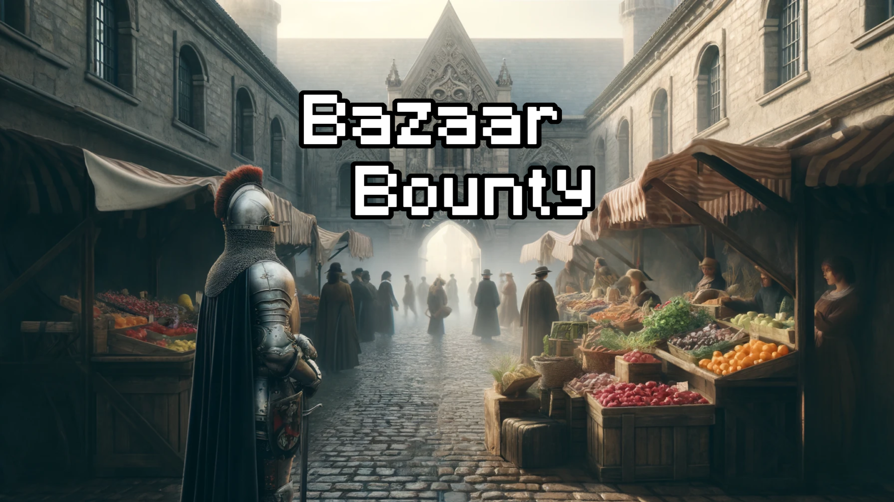

# Bazaar Bounty

Obtain the Bazaar's Bounty! Use fruit and vegetable power-ups to reclaim the medieval marketplace from a pesky infestation. This is one of the games from ETH's **[Game Programming Laboratory 2024](https://gtc.inf.ethz.ch/education/game-programming-laboratory/previous-years/2024.html)**



Enter "Bazaar Bounty," a captivating roguelike dungeon crawler set in a lively medieval marketplace overrun by a pesky infestation. Each game level unfolds in uniquely randomized maps, brimming with vibrant bazaar stalls and narrow alleys. Players must harness an arsenal of veggie and fruit power-ups to enhance their trusty sword and gun, battling through diverse and unpredictable enemies that lurk around every corner. From sword-wielding rats to magic-wielding lizards, the challenge is ever-changing. Navigate through the chaos, utilize strategic power-ups, and reclaim the bazaar's bounty!

## Features

- **20-level run** through a medieval bazaar, split into two stages with a peaceful tutorial, a mid-run transition, and a final red-lizard encounter
- **Procedural variety**: maps are drawn from a pool of Tiled layouts, with randomized enemy placement, spawn budgets that grow over the run, and tile swaps that vary walls, trees, and stalls
- **Dual combat**: melee sword and ranged gun, plus a dash. Time a sword swing to parry enemy bullets back at them
- **Fruit power-ups**: clear a hostile room to drop a fruit bag, then pick one buff — healing, ammo, shotgun conversion, dash damage, bullet reflection, and more
- **Enemy roster**: slimes, bats, sword rats, goblins, and magic lizards, each with color variants that get faster and hit harder
- **Mouse & keyboard or Xbox gamepad**, with a HUD for health, ammo, dash cooldown, defenses, and active buffs

## How to Play

1. Start a **New Game** from the main menu. A short tutorial explains the goal, then the first map loads.
2. Defeat every enemy in the room. A fruit bag appears when the last one falls — walk into it and choose a power-up.
3. Walk through the **door** once the room is clear to enter the next level.
4. Survive all 20 levels to win. If your health hits zero, the run ends.

Stage 1 covers the early bazaar (levels 1–10). Stage 2 ramps up enemy variants and unlocks stronger fruit effects (levels 11–20). The last map pits you against enraged red lizards that fire a five-way magic spread.

**Hint:** swing the sword at the right moment to deflect incoming bullets.

## Controls

### Mouse & keyboard

| Action | Input |
| --- | --- |
| Move | `W` `A` `S` `D` |
| Look | Mouse position |
| Melee attack (sword) | Left mouse button |
| Ranged attack (gun) | Right mouse button |
| Dash | `Left Shift` |
| Pause / resume | `P` |
| Toggle fullscreen | `F10` |
| Volume up / down | `O` / `L` |
| Debug overlay | `H` |
| Quit | `Esc` |

### Xbox gamepad

| Action | Input |
| --- | --- |
| Move | Left thumbstick |
| Look | Right thumbstick |
| Melee attack | Right bumper |
| Ranged attack | Left bumper |
| Dash | Left or right trigger |
| Confirm (menus) | `A` |
| Quit | `Back` |

The game switches between mouse/keyboard and gamepad automatically based on the last input used.

## Enemies

| Enemy | Role |
| --- | --- |
| **Slime** | Melee lurcher that closes in, then lunges |
| **Bat** | Flying melee attacker; ignores some ground obstacles while pathfinding |
| **Rat** | Sword-wielding melee fighter |
| **Goblin** | Melee bruiser with a delayed sword swing |
| **Lizard** | Magic caster. Purple lizards fire a single shot; blue lizards fire a triple spread; red lizards fire a five-way shotgun |

Color variants (green/brown/purple → blue → red) share the same behavior with higher speed and damage. Enemies patrol until they spot you, then chase or kiting-shoot using A\* pathfinding.

## Fruit Power-ups

After a hostile room is cleared, a fruit bag with two (sometimes three) options appears. Pick one.

| Fruit | Effect |
| --- | --- |
| **Apple** | Restore 20% of maximum health |
| **Watermelon** | Restore 10 bullets |
| **Banana** | Refill ammo, double bullet speed, and halve gun cooldown for 20s |
| **Coconut** | Larger sword that deals double damage, with a slower swing, for 25s |
| **Grape** | Refill ammo and turn the gun into a shotgun for 20s |
| **Peach** | Faster walk and dash; dashing into enemies deals damage, with a longer dash cooldown, for 45s |
| **Mango** | Greatly increase ranged defense and auto-reflect hostile bullets for 30s |
| **Orange** | Increase melee and ranged defense for 25s |
| **Cherry** | Permanently increase maximum health and both defenses by 10% |

Later levels upgrade several of these into stronger “II” versions (for example extra max health on Apple, infinite ammo on Banana at a health cost, or a 25% Cherry boost).

Combat stats, spawn budgets, and fruit numbers live in `src/BazaarBounty/settings.json` and can be tuned without rebuilding game logic.

## Building and Running

### Requirements

- [.NET 6 SDK](https://dotnet.microsoft.com/download/dotnet/6.0)
- Windows, Linux, or macOS (MonoGame DesktopGL)
- Visual Studio 2022 is optional; the included solution targets it

### Run from source

```bash
cd src/BazaarBounty
dotnet restore
dotnet run
```

Or open `src/BazaarBounty/BazaarBounty.sln` in Visual Studio and press F5.

The default window is 1920×1080. The game toggles fullscreen on startup; use `F10` to switch back to windowed mode.

### Publish a standalone build

```bash
cd src/BazaarBounty
dotnet publish -c Release -r win-x64 --self-contained false
```

The executable and content are written under `src/BazaarBounty/bin/Release/net6.0/win-x64/publish/`.

## Project Structure

```
BazaarBounty/
├── README.md
├── game_teaser.jpg
├── assignments/                 # presentation copy for the original course
└── src/BazaarBounty/
    ├── BazaarBounty.cs          # game loop, camera, collision, state machine
    ├── Program.cs
    ├── settings.json            # graphics, enemies, fruits, spawn budget
    ├── Assets/                  # Myra UI layouts, fonts, menu art
    ├── Content/                 # MonoGame content (sprites, maps, audio)
    │   ├── Characters/
    │   ├── Fruits/
    │   ├── Maps/                # Tiled .tmx maps and tilesets
    │   ├── Musics/
    │   ├── SoundEffects/
    │   ├── UI/
    │   └── WeaponsAndProjectiles/
    └── Game/
        ├── Characters/          # player, enemies, AI
        ├── Map/                 # Tiled loader, level flow, A* navigation
        ├── UI/                  # menus, tutorial, HUD, fruit picker
        ├── Utils/               # fruits, projectiles, particles, audio
        ├── Controller.cs        # input routing and behavior trees
        └── Weapon.cs            # sword, gun, enemy magic
```

Maps are authored in [Tiled](https://www.mapeditor.org/) (`.tmx`). Placeholder tiles mark player spawns, enemy spawn zones, walls, and exit doors.

## Tech Stack

- **C# / .NET 6**
- **[MonoGame](https://www.monogame.net/) 3.8.1** (DesktopGL) for rendering, audio, and content
- **[MonoGame.Extended](https://github.com/craftycorvid/MonoGame.Extended)** for camera, collisions, and particles
- **[Myra](https://github.com/rds1983/Myra)** for menus and HUD
- **Tiled** maps loaded at runtime

## Team

Shenghao Zhang, Yingzhe Liu, Minsung Kang, Yu-Wei Shih, and Oemer Alkaya
